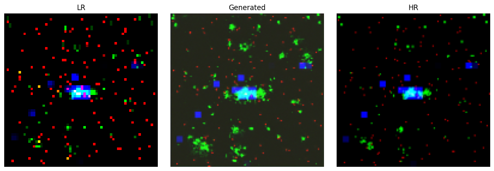
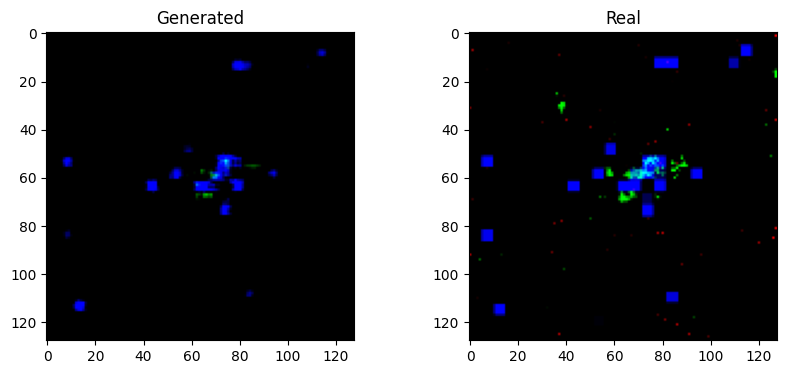

# Super resolution at the CMS detector

**GSoC 2026 ml4sci - Specific Tasks 2b** 

This project explores how modern generative models can reconstruct **high-resolution jet images** from **low-resolution detector images**.

We compare two approaches:
-  Diffusion Models 
- GAN-based Super-Resolution (baseline)

---

## Overview

### Problem

Jet images from particle physics experiments have **limited resolution**, which affects:
- Jet classification
- Substructure analysis
- Physics measurements

### Solution

Instead of upgrading hardware, we use **deep learning** to:
- Learn from LR–HR image pairs  
- Reconstruct missing details  
- Preserve important physical features  

---

## Models Used

### 1. Diffusion Model 

- Learns to **gradually remove noise** from images  
- Produces **stable and consistent results**  
- Captures global structure using attention  

**Key strengths:**
- High-quality reconstructions  
- Stable training  
- Better physical consistency

### Output from conditional diffusion 

---

### 2. SRGAN (Baseline)

- Uses **Generator + Discriminator**
- Generator creates HR images from LR input  
- Discriminator checks realism  

**Key strengths:**
- Sharp outputs  
- Fast inference  

**Limitations:**
- Less stable training  
- Can introduce artifacts

### Output from SRGAN

---

## Dataset

- Paired **Low-Resolution (LR)** and **High-Resolution (HR)** jet images  
- Stored in `.npz` format  

**Structure:**
- Training / Validation / Test splits  
- Multi-channel jet images  

---

## Preprocessing

To handle physics data:

- Remove low-energy noise  
- Apply log scaling  
- Normalize values  
- Clip outliers  

---

## Project Structure

    gsoc_2026/
    ├── notebook/        # Model training notebooks
    ├── data/            # Dataset and preprocessing
    ├── model_weights/   # Saved models
    ├── output/          # Generated results
    └── README.md

---

## Training

### Diffusion Model
- Learns to predict noise at different steps  
- Uses MSE loss  
- Iterative denoising process  

### GAN
- Alternates between:
  - Discriminator training  
  - Generator training  (unet based architecture)
- Uses adversarial + L1 loss - **introduced seperate loss for each channel for experimenting**

---

## Inference

### Diffusion
- Start from random noise  
- Gradually refine image  
- Produces high-quality outputs  

### GAN
- Directly generates HR image from LR  
- Much faster but less stable  

---

## Setup

Basic requirements:
- Python 3.8+
- PyTorch
- NumPy, Matplotlib

---

## Acknowledgments

- Google Summer of Code 2026  
- CMS Collaboration  
- Open-source community  
